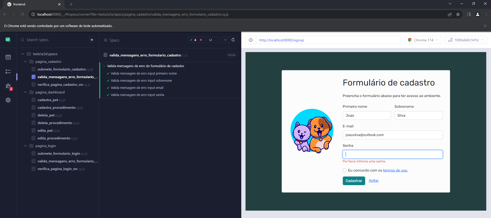
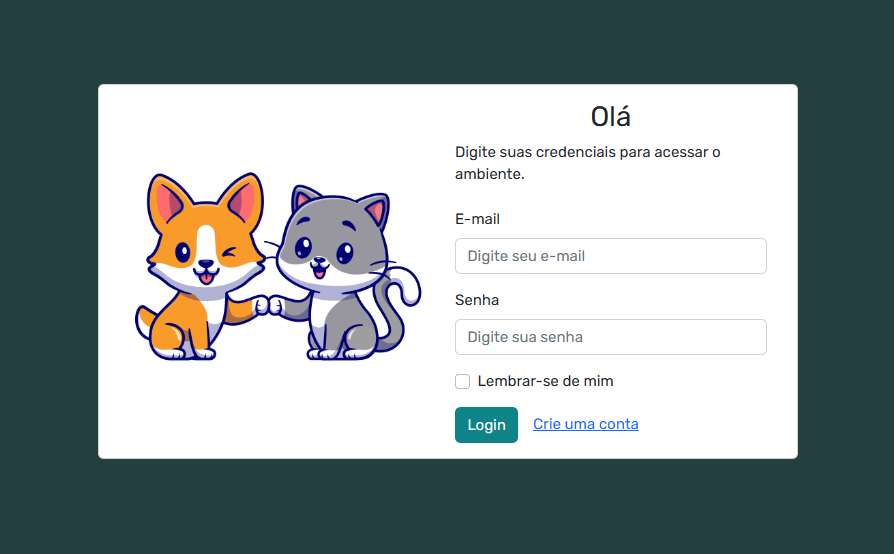
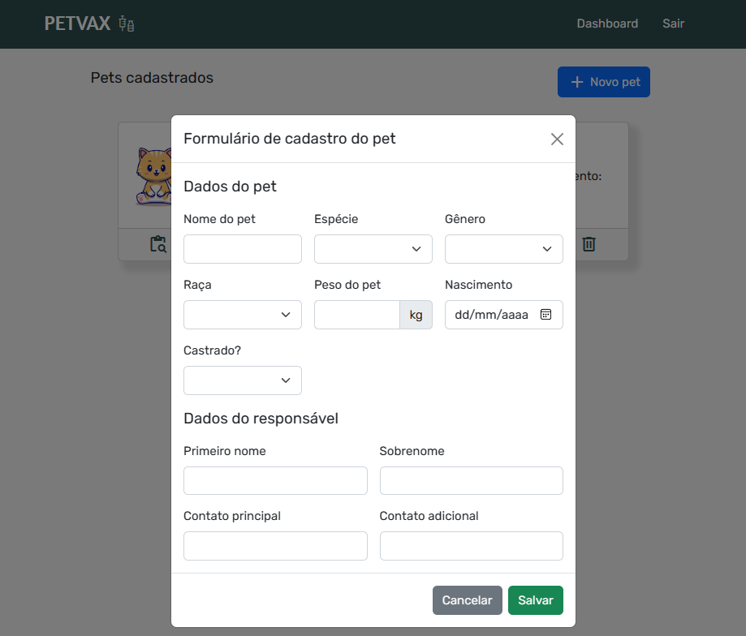
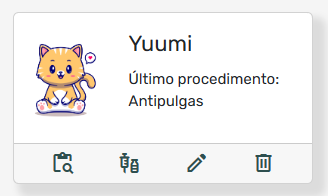
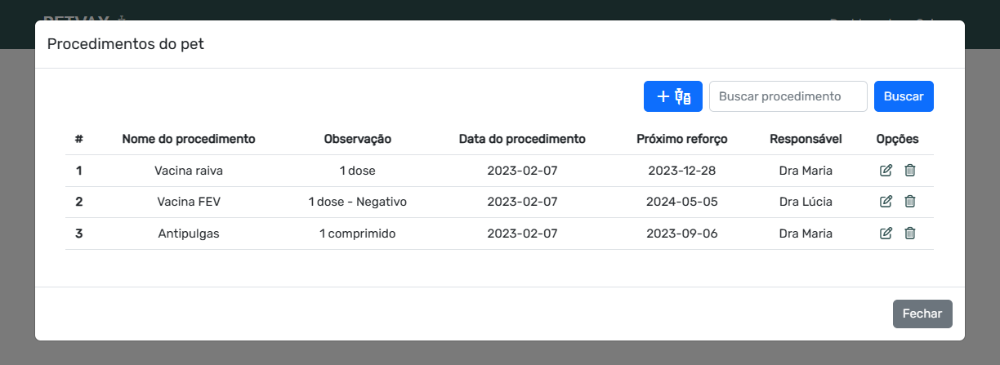
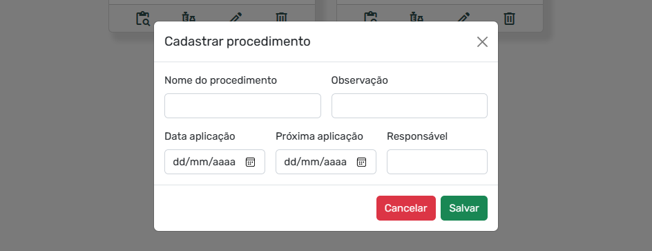

# O projeto

Criei este projeto com o objetivo de aplicar meus conhecimentos em Vue 3 e automação de testes. Esta aplicação tem o foco em cadastrar pets que visitaram o veterinário. Nela, é possível submeter um cadastro para efetuar o login na aplicação, além de cadastrar, editar e excluir um pet. O usuário também pode cadastrar um procedimento para o pet, que por debaixo dos panos será vinculado através do _id do pet no MongoDB. Além disso, implementei testes automatizados do front-end utilizando o Cypress 12. O backend foi feito em outro projeto, o banco de dados não relacional utilizado foi o MongoDB.

A aplicação está dividida em:

- [Tela de login](#tela-de-login)
- [Tela de cadastro](#tela-de-cadastro)
- [Dashboard](#dashboard)

## Dependências

Neste projeto foi utilizado as seguintes dependências:

- Fontawesome
- Axios
- Bootstrap
- Vue
- Vue router
- Vue CLI
- Cypress

Para instalar as dependências do projeto basta digitar o comando abaixo no terminal:

`$ npm install`

## Automação com Cypress

A aplicação ficou bastante precária, o que resultou em várias das possibilidades que eu planejava para a criação dos testes não terem sido bem sucedidas. Por esse motivo, decidi realizar apenas alguns testes e iniciar um novo projeto, com o objetivo de aprimorar meus conhecimentos e melhorar ainda mais meus testes automatizados.

Para executar os testes basta digitar no terminal:

`npm run cypress`

## Telas e funcionalidades

### Tela de login

Nesta tela, o usuário poderá efetuar o login na aplicação com os dados efetuados no cadastro.

### Tela de cadastro

Nesta tela, o usuário pode realizar o cadastro para obter acesso às credenciais para acessar à aplicação.

### Dashboard

Nesta tela o usuário poderá visualizar os pets cadastrados e também terá acesso a algumas funcionalidades.

**Novo pet**

Exibe um formulário para cadastro de um novo pet após cadastrado será feito uma chamada no backend pelo axios para que a lista de pet cadastrados seja atualizada automaticamente.

**Card**

No card exibido quando algum pet está cadastrado podemos acessar as seguintes funcionalidades:

- Ver carteirinha: nesta opção será exibido ao usuário a carteirinha do pet com as informações que foram preenchidas no formulário de cadastro. Essas informações vem do MongoDB.

- Ver procedimentos: nesta opção será exibido ao usuário os procedimentos cadastrados para o pet. 

    - Adicionar novo procedimento: nesta opção será exibido ao usuário um formulário de cadastro de um novo procedimento.

    - Buscar: ação não implementada.

    - Listagem: será listado ao usuário todos os procedimentos cadastrados para o pet selecionado. Essas informações vem do MongoDB.

- Editar informações do pet: nesta opção será exibido um formulário com todas as informações pertinentes ao pet já cadastrado. Aqui o usuário poderá alterar qualquer informação que após ser salva será automaticamente atualizado na carteirinha do pet. Essas informações vem do MongoDB.

- Deletar pet: nesta opção após confirmado será deletado o pet cadastrado. Não foi implementado o delete na collection procedures, ou seja, quando o pet é excluído, não será excluído todos os procedimentos cadastrados com o ID dele. 

**Sair**

Desloga o usuário da aplicação, por debaixo dos panos é removido o user_token do local storage do navegador.
